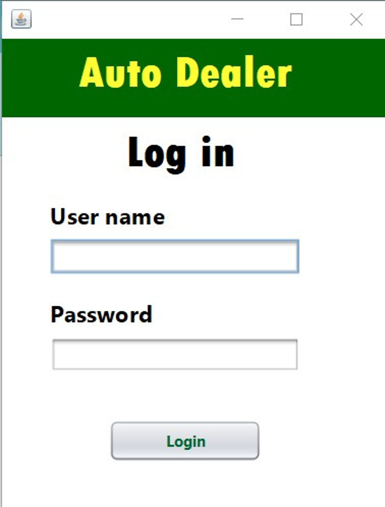
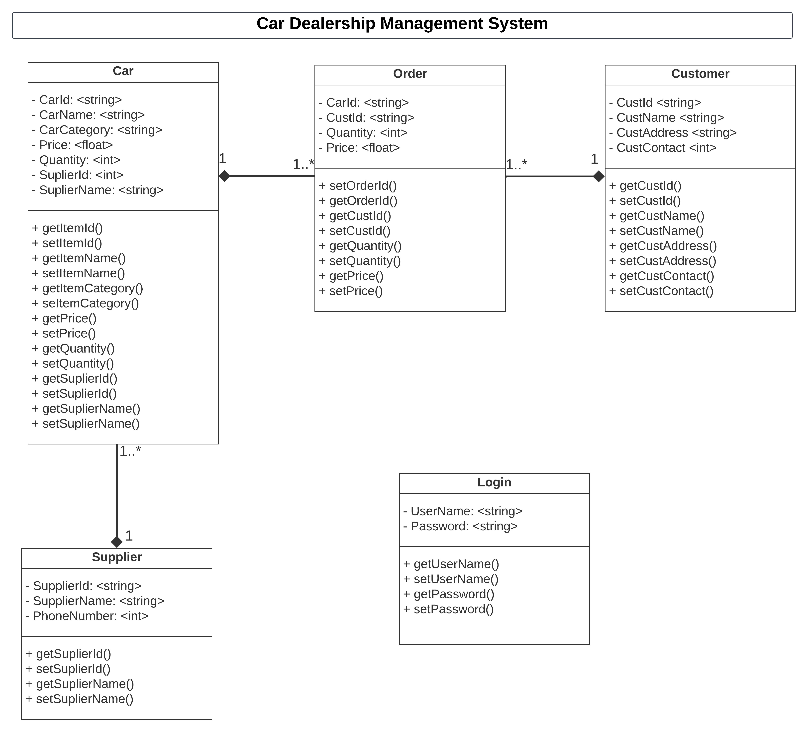

# Car Dealership Management System (POS)

## Introduction
Our team has developed a robust application known as the Car Dealership Management System (CDMS). This Java-based application is designed to revolutionize the management of car dealerships in Colombo.

## Objective
- Provide a comprehensive and easy-to-use system for managing car dealerships in Colombo.
- Improve the efficiency and accuracy of car dealership operations.
- Reduce the workload on car dealership staff.
- Gain a competitive advantage by providing dealerships with information more efficiently and effectively.

## Methodology
The car dealership management system was developed using the Java Standard Edition (SE) framework and MySQL for the database. The architecture follows a client-server model, with the client side implemented using Java for the graphical user interface and the server side utilizing MySQL for data storage and retrieval. The system architecture consists of two primary components:

### Front-end (Client-Side)
- Implemented using Java SE for the development of a Graphical User Interface (GUI) to provide users with an interactive platform for managing dealership operations.
- Utilized Java Swing and AWT libraries to create the visual components, including panels, buttons, text fields, and tables.

### Back-end (Server-Side)
- Employed MySQL for database management, handling data storage and retrieval functionalities.
- Leveraged Java Database Connectivity (JDBC) to establish a connection with the MySQL database and perform CRUD (Create, Read, Update, Delete) operations.
  
The project adopted an Agile development approach, facilitating iterative and incremental development. The use of Agile methodologies enabled frequent feedback, constant collaboration with group members, and the ability to adapt to changing requirements throughout the development lifecycle.

## Features

### Login
Check the username and password and let the user log in to the system. Upon successful installation, the product window will appear.

Login Page

### Customer
Allow users to ADD, DELETE and UPDATE new customer profiles. The current database is displayed on the window itself.

Customer Page

### Product 
Enables users to ADD, DELETE, and UPDATE the Car ID, Car Name, Category, Year, Supplier Name, Year, Price and Supplier ID in the database.

Product Page

### Supplier
Facilitates adding new suppliers, removing already added suppliers and displaying the current database table of suppliers.

Supplier Page

### Order
Allow the user to add Customer ID, Product Name, Category, Quantity, Payment Method, Year, and Price and print the current database.

Order Page

## Additional Information

The CDMS employs the Model-View-Controller (MVC) architecture, ensuring a clear separation between data representation, user interface, and user interactions. This design enhances the system’s efficiency and makes it user-friendly.

### Benefits

- **Platform Independence:** The CDMS can be easily run on any computer, without requiring advanced knowledge of computers or databases, thanks to the use of Java and Swing.
- **Efficiency:** By automating various tasks, the system reduces the workload on dealership staff, allowing them to focus on more critical aspects such as customer service and car sales.
- **Customer Satisfaction:** By providing personalized service, the CDMS ensures superior customer experience, giving the dealers a competitive edge in the market.
- **Productivity:** The system improves employee productivity by freeing up staff to focus on essential tasks and providing tools to manage operations effectively.
- **Competitive Advantage:** The CDMS positions car dealerships for success in a competitive industry by providing efficient and effective information management.

We believe the CDMS project will be feasible for the following reasons:

- **Java and Swing:** Java is a popular and well-supported programming language, and Swing components are platform-independent.
- **MVC Architecture:** The MVC architecture is a well-established and proven software design pattern. It separates concerns, making the code easier to understand, maintain, and test.

## Class Diagram & Use Case Diagram

<!--  -->

<be>
 

In summary, the Car Dealership Management System (CDMS) is a comprehensive solution designed to enhance the management of car dealerships, improve operational efficiency, and provide a competitive edge in the marketplace.
